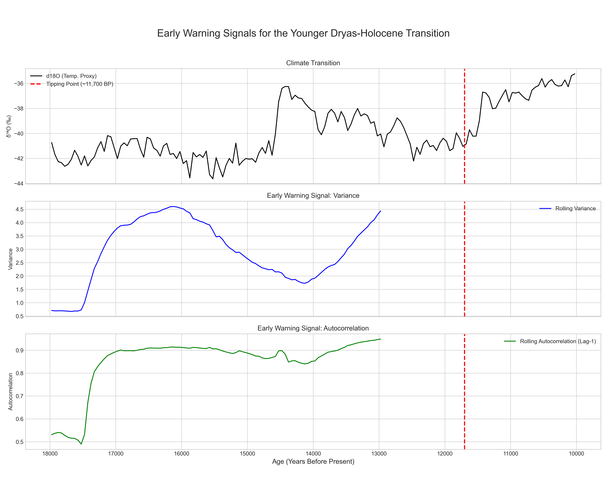

# Early Warning Signals for Climate Tipping Points

An analysis of the NGRIP ice core dataset to detect statistical precursors to the abrupt climate transition at the end of the Younger Dryas. This project serves as a practical application of data science techniques to the critical domain of climate science and systemic risk assessment.

---

## Project Overview

The stability of the Earth's climate is a foundational pillar of modern civilization. However, paleoclimate records reveal that the climate system can undergo extremely rapid, high-impact shifts, known as "tipping points." Understanding if these transitions are predictable is a key area of scientific research.

This project investigates the hypothesis that a system approaching a tipping point exhibits "Critical Slowing Down," a phenomenon that leaves detectable statistical signatures in its time-series data. I apply this theory to real-world data to answer the question: **Can we find early warning signals for one of Earth's most recent and dramatic climate tipping points?**

### Key Features
-   **Real-World Data:** Utilizes the high-resolution North Greenland Ice Core Project (NGRIP) d18O dataset from NOAA.
-   **Scientific Methodology:** Implements a rolling-window analysis to compute two standard Early Warning Signals (EWS):
    1.  **Variance**
    2.  **Lag-1 Autocorrelation**
-   **Clear Validation:** Successfully identifies and visualizes the statistical precursors leading up to the abrupt warming event ~11,700 years ago.
-   **Reproducible Code:** Provides a clean, commented Python script to reproduce the entire analysis.

---

## Results: Detecting the Tipping Point

The analysis successfully identified clear statistical signals that preceded the abrupt climate transition. The plot below visualizes the primary result:

### Interpretation of Results

*   **Plot 1: Climate Transition (d18O Temperature Proxy)**
    This plot displays the raw temperature proxy data. It clearly shows a system in a stable, cold state (the Younger Dryas) that undergoes an extremely rapid and large transition to a warm state (the Holocene) at the tipping point (red dashed line).

*   **Plot 2: Early Warning Signal (Rolling Variance)**
    This plot shows the variance calculated over a rolling 3,000-year window. The steady increase in variance leading up to the tipping point indicates that the climate system was becoming increasingly unstable and experiencing larger swings away from its average state as it lost resilience.

*   **Plot 3: Early Warning Signal (Rolling Autocorrelation)**
    This plot shows the lag-1 autocorrelation, which measures the system's "memory". The clear and sustained rise before the transition is a classic signal of **Critical Slowing Down**, meaning the system was taking longer and longer to recover from small perturbations, a hallmark of an approaching tipping point.

---

## Data Source

The data used in this project is the **North GRIP - 50-year Averaged Oxygen Isotope Data**. It is publicly available from the NOAA National Centers for Environmental Information (NCEI).

-   **Study Page:** [https://www.ncei.noaa.gov/access/paleo-search/study/2481](https://www.ncei.noaa.gov/access/paleo-search/study/2481)
-   **Direct Data Link:** [https://www.ncei.noaa.gov/pub/data/paleo/icecore/greenland/summit/ngrip/isotopes/ngrip-d18o-50yr-noaa.txt](https://www.ncei.noaa.gov/pub/data/paleo/icecore/greenland/summit/ngrip/isotopes/ngrip-d18o-50yr-noaa.txt)

## License

This project is licensed under the MIT License - see the [LICENSE](LICENSE) file for details.

## Acknowledgments
-   Thanks to the **North Greenland Ice Core Project (NGRIP) members** for their incredible work in collecting this valuable data.
-   Thanks to the **NOAA Paleoclimatology Program** for making this data publicly accessible.
